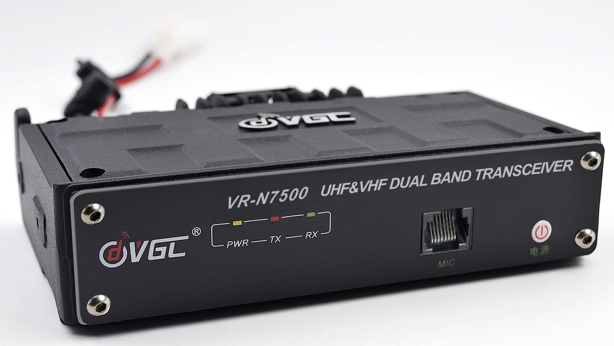

.. VR-N7500 documentation master file, created by
   sphinx-quickstart on Thu Aug 13 20:01:55 2020.
   You can adapt this file completely to your liking, but it should at least
   contain the root `toctree` directive.

Welcome to the inofficial documentation of VR-N7500
===================================================

VGC VR-N7500 is a full-featured dual-band mobile radio that can be controlled via Bluetooth using a smartphone (Andorid or iPhone). There is no classic control panel. It can be installed discreetly and completely invisibly in the vehicle and connected to a Bluetooth hands-free connection.

Here is an overview of the features:

  * Up to 40W on UHF and 50W on VHF with
  * Different regions with 16 channels per region
  * APRS capability
  * Morse code encoder/decoder (Android only)
  * SSTV Encoder/Decoder (Android only)
  * Cable Microphone
  * Bluetooth PTT
  * Bluetooth Microphone
  
Community
=========
  
  * German Telegram Group: https://t.me/VRN7500
  * English Facebook Group: https://www.facebook.com/groups/2285774288379471
  * UK Facebook Group: https://www.facebook.com/groups/578663932978555

.. toctree::
   :maxdepth: 2
   :caption: Contents:

   android
   iphone

